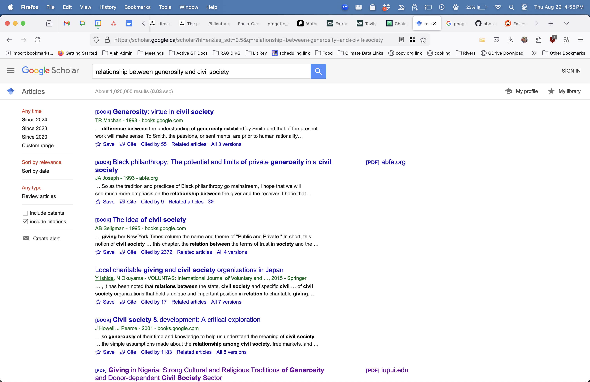

# Initial Exploration
With at least a rough idea of our objective in mind, we can start looking for resources that help us answer our questions.  In the twentieth century, this would have involved a trip to the library.  Today, there are two main routes we can take, and for now, we should probably use both of them. 

## Use a CustomGPT

[ScholarAI](https://app.scholarai.io) is a proprietary service built on top of ChatGPT. It has a free tier that allows a few interactions/month through its custom interface; the CustomGPT itself is also [available directly on ChatGPT](https://chatgpt.com/g/g-L2HknCZTC-scholar-ai) for unlimited usage.  Here we ask ScholarAI a simple question, an receive an answer that gives us a little bit of insight into possible avenues of exploration. The transcript [can be found in ChatGPT here](https://chatgpt.com/g/g-L2HknCZTC-scholar-ai/c/66ec23ca-5c80-8001-b8f2-0559963af71c). What we find is that the CustomGPT, while imperfect, is a useful "tool to think with": its answers, which are essentially plagiarized from all of scientific literature, are not particularly thoughtful, but they indicate possible directions for exploration. 

:::{note}Query
what is the relationship between generosity and civil society?
:::

:::{note}Response
The relationship between generosity and civil society is multi-faceted, with acts of giving playing a crucial role in shaping the strength and functionality of civil society. Various forms of generosity, such as philanthropy, mutual aid, and informal gift-giving, serve as mechanisms through which communities bond, social capital is built, and civic engagement is fostered.

Herzog and Price (2016) argue that generosity benefits both givers and receivers, creating complex socio-relational networks that support civil society ([Herzog & Price, 2016](https://dx.doi.org/10.1093/acprof:oso/9780190456498.003.0008)). This reinforces the idea that acts of giving are integral to the health of civil society by enhancing social cohesion.

Historically, charitable organizations and mutual aid societies have been central to maintaining social stability and political engagement, as demonstrated by the work of Weinbren (2007), who highlights the role of reciprocity in charitable acts in nineteenth-century Britain ([Weinbren, 2007](https://dx.doi.org/10.4324/9780203932407-8)).

Generosity also plays a crucial role in addressing social inequalities. Tajudin et al. (2021) discuss how philanthropy fosters social and economic welfare by promoting a culture of mutual aid that strengthens justice and moral responsibility within society ([Tajudin et al., 2021](https://dx.doi.org/10.32493/JLS.V3I1.P36-45)).

Philanthropy can be understood as a "gift economy," where the exchange of gifts fosters community bonds, reinforcing the importance of generosity in civil society ([Fischer, 1994](https://dx.doi.org/10.1002/PF.41219940604)). These examples illustrate how generosity acts as a catalyst for social cooperation, the foundation of civil society.

In early modern England, informal support and gift-giving were shown to create binding ties within civil society, as Schen (2009) explores, suggesting that generosity is a vital element in building strong social relations ([Schen, 2009](https://dx.doi.org/10.1080/03071020902981865)).

In summary, generosity and civil society are intertwined, with acts of giving reinforcing social bonds, promoting equity, and fostering civic engagement, all of which are crucial for the health of civil society.
:::

This gives us a small number of initial sources to work with, and we can easily click on the links and add them to a new Zotero library. However, it's worth noting that the GPT can make mistakes.  I don't notice any in this iteration, but in an earlier version, ScholarAI incorrectly attributed arguments about generosity to an [unrelated article about Greek civil society](https://dx.doi.org/10.1080/13629395.2016.1140282).  

There are other similar tools, but you get the flavor: these AI-based services are able to generate a very quick, very rough overview of some of the ways in which the central question may have been discussed in scholarly literature.  You shouldn't rely on the assessment, but you begin to formulate some ideas about your next steps, and you can harvest a small number of resources into a library, which you will expand in the next few steps.  .

## Google Scholar

Google scholar is still an important source of information.  It performs a much simpler keyword search using similarity metrics & citation rankings to provide an ordered list of (usually) scholarly articles that hopefully have something to do with the topic at hand. It does not, however, attempt automated summaries of the resources.

[This search](https://scholar.google.ca/scholar?hl=en&as_sdt=0%2C5&q=relationship+between+generosity+and+civilsociety&btnG=) returns over a million results, very few of which will be relevant to us. 

The key is to rapidly capture the ones that look promising.  The best tool to do this is [Zotero](https://zotero.org). In the screenshot, you can see that I've set up a new Zotero collection and have downloaded the first few sources.  Right now it's a small collection.

After this initial pass, I'll scroll through a couple of pages of Google Scholar looking for more sources.  After 3 or 4 pages I have about two dozen sources &#x2013; not a lot, and it's not a huge reward for the time spent.  On the other hand, I have pretty strong confidence that I've chosen some good sources.

Now we're ready for the next step. 

<!-- Local Variables: -->
<!-- jinx-local-words: "Schen ScholarAI Tajudin Weinbren al et socio" -->
<!-- End: -->
